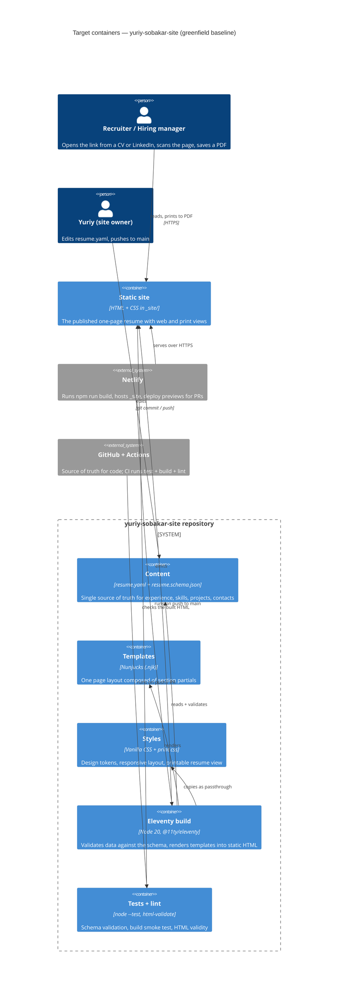

# Architecture map — yuriy-sobakar-site

> Цільовий фундамент (`mode: greenfield-bootstrap`), зафіксований у foundation-сесії `survey`
> 2026-09-05 разом із власником. C4 нижче описує **те, що зараз буде заскафолджено**, а не наявний
> код: у репозиторії на момент карти є лише `docs/idea-brief.md`, `.gitignore` та налаштування SDD.
> Читають: `scaffold` (матеріалізує скелет), `specify` (обмеження), `design`, `implement`.
> Оновлювати через `survey`, коли репозиторій піде далі за `reflects_commit`.

## Stack

- **Мова / рантайм:** JavaScript (ESM) на Node.js 20+ — без TypeScript і без транспіляції; браузерного JavaScript на сторінці немає, крім одного виклику друку (`package.json`, після скаффолду).
- **Генератор сайту:** Eleventy 3 (`@11ty/eleventy`) — читає шаблони Nunjucks та файл даних і віддає статичний HTML у `_site/` (`eleventy.config.js`). Рішення → `docs/adr/0001-static-site-generator-eleventy.md`.
- **Дані:** один файл `src/_data/resume.yaml` + JSON Schema `src/_data/resume.schema.json`; YAML підключається до Eleventy через data extension (`eleventy.config.js`). Рішення → `docs/adr/0002-content-single-yaml-with-schema.md`.
- **Стилі:** чистий CSS з кастомними властивостями (дизайн-токени) та окремим `print.css`; жодного препроцесора чи утилітарного фреймворку. Рішення → `docs/adr/0003-styling-vanilla-css-and-print-view.md`.
- **PDF:** друковані стилі + кнопка «Download PDF», яка викликає системний друк браузера; файл PDF не генерується і не зберігається. Рішення → `docs/adr/0004-pdf-via-browser-print.md`.
- **Build / test / lint:** `npm run build` → `npx @11ty/eleventy`; `npm test` → `node --test test/` (вбудований ранер Node, без залежностей); `npm run lint` → `npx html-validate "_site/**/*.html"`. Ці команди читає `implement`.
- **CI / деплой:** GitHub Actions (`.github/workflows/ci.yml`: install → test → build → lint) на кожен push і pull request; Netlify збирає `npm run build` і публікує `_site` (`netlify.toml`), гілка `main` = production, pull request = deploy preview.

## C4 — system as it is

## Module inventory

| Module | Path | Layers | Wired at | Responsibility |
|---|---|---|---|---|
| content | `src/_data/` | data | `eleventy.config.js` (yaml data extension) | `resume.yaml` — весь зміст сайту; `resume.schema.json` — контракт полів, перевіряється тестом і під час збірки |
| templates | `src/index.njk`, `src/_includes/` | presentation | `eleventy.config.js` (input `src`, includes `_includes`) | `layout.njk` — каркас сторінки; `sections/*.njk` — по одному партіалу на секцію резюме (hero, experience, skills, projects, contacts, built-with) |
| styles | `src/styles/` | presentation | `layout.njk` (`<link>`), passthrough copy in `eleventy.config.js` | `tokens.css` (кольори, відступи, типографіка), `base.css`, `layout.css` (адаптив), `print.css` (`@media print`) |
| assets | `src/assets/` | static | passthrough copy in `eleventy.config.js` | зображення, favicon, шрифти (якщо self-hosted) |
| build config | `eleventy.config.js`, `package.json`, `netlify.toml` | infra | — | вхід/вихід Eleventy, npm-скрипти, команда і папка публікації для Netlify |
| tests | `test/` | test | `package.json` → `npm test` | `resume-schema.test.js` (YAML валідний за схемою), `build.test.js` (збірка проходить, у `_site/index.html` є ключові секції та контакти) |
| ci | `.github/workflows/ci.yml` | infra | GitHub Actions | install → `npm test` → `npm run build` → `npm run lint` |
| docs | `docs/` | docs | — | бриф, ця карта, ADR, роадмап, артефакти фіч (`docs/features/<slug>/`) |

## Conventions (cited — the rules a new feature must match)

Правила, яким слідує скаффолд і кожна наступна фіча (файли з'являються після `/sdd:scaffold`):

- **Один джерело змісту:** будь-який текст, що показується на сторінці, береться з `src/_data/resume.yaml`; хардкод тексту в шаблонах заборонений, окрім службових підписів (назви секцій задаються в YAML також) — `src/_data/resume.yaml`.
- **Схема даних обов'язкова:** нове поле в YAML спершу додається в `src/_data/resume.schema.json`, тест схеми падає до оновлення обох — `test/resume-schema.test.js`.
- **Шаблони:** одна сторінка `src/index.njk` збирається з партіалів `src/_includes/sections/<section>.njk`; кожна секція — окремий партіал, підключений через `` у порядку, заданому масивом у YAML — `src/_includes/layout.njk`.
- **Стилі:** значення кольорів/відступів/шрифтів тільки через кастомні властивості з `src/styles/tokens.css`; розкладка — CSS Grid/Flex, mobile-first, брейкпоінти в `layout.css`; усе друковане — тільки в `src/styles/print.css` (`@media print`), без ефектів, що не переживають друк (анімації, темні заливки) — `src/styles/print.css`.
- **Без клієнтського JavaScript**, окрім одного inline-обробника кнопки друку (`window.print()`); будь-яка інтерактивність понад це потребує ADR — `src/_includes/sections/hero.njk`.
- **Тести:** вбудований ранер Node (`node --test`), файли `test/*.test.js`; кожен тест або перевіряє дані за схемою, або збирає сайт у тимчасову папку і читає HTML — `test/build.test.js`.
- **Помилки збірки:** невалідний YAML зупиняє збірку з повідомленням про поле (валідація у data extension), а не публікує порожню секцію — `eleventy.config.js`.
- **Гілки і коміти:** фічі — у гілках `feat/<slug>`, у `main` потрапляють через pull request з зеленим CI і deploy preview Netlify; коміти в стилі `type: summary` — `.github/workflows/ci.yml`.
- **Міграції / ідентифікатори:** N/A — бази даних немає, персистентність = файл у git.

## Datastores

| Store | Engine | Accessed via | Notes |
|---|---|---|---|
| `src/_data/resume.yaml` | файл у git | Eleventy global data (`resume.*` у шаблонах) | Єдине джерело правди; історія змін = історія git. Бази даних немає і не планується. |

## Frontend / UI foundation

- **Component library / design system:** власна, мінімальна — партіали секцій у `src/_includes/sections/` і токени; сторонніх UI-кітів немає — `src/_includes/sections/`.
- **Design tokens:** кастомні властивості в `src/styles/tokens.css` (палітра, шкала відступів, типографіка, радіуси); темна тема — через `prefers-color-scheme`, якщо буде обрана в design — `src/styles/tokens.css`.
- **Styling approach:** vanilla CSS, mobile-first, `@media print` в окремому файлі — `src/styles/layout.css`, `src/styles/print.css`.
- **Shared primitives:** `section` з заголовком, `tag`/`chip` для навичок, `card` для проєктів, `timeline-item` для досвіду, `button` (друк, посилання) — визначаються в `src/styles/base.css` як класи; нова секція складається з них.
- **State / data-fetching:** немає — сторінка статична.
- **Closest UI precedent:** нова секція виглядає як `src/_includes/sections/experience.njk` (заголовок із YAML + цикл по масиву + картки/елементи таймлайну).

## Where things live / closest precedents

- Нова секція резюме → партіал у `src/_includes/sections/`, поле в `resume.yaml` + `resume.schema.json`, підключення в `layout.njk`; за зразком `experience.njk`.
- Зміна тексту/досвіду → тільки `src/_data/resume.yaml`; тест схеми і тест збірки підтвердять, що все на місці.
- Зміна вигляду → токени в `tokens.css`, розкладка в `layout.css`; друковану версію правити окремо в `print.css` і перевіряти через Print preview.
- Секція «як зроблено цей сайт» → `src/_includes/sections/built-with.njk`, посилання на репозиторій і на `docs/` беруться з YAML.
- Хостинг/деплой → `netlify.toml` (build = `npm run build`, publish = `_site`); домен і редіректи — там само.

## Constraints & known tech-debt

- **Розмір XS і профіль Pro:** обсяг фічі тримати в 3–5 задач; жодних нових контейнерів (бекенд, БД, CMS, форми) без окремого ADR — випливає з `docs/idea-brief.md` §5.
- **Статичний хостинг Netlify:** серверного коду немає; будь-яка «динаміка» — лише на етапі збірки.
- **Друк — обмеження дизайну:** дизайн не може спиратися на анімації, темні заливки чи ефекти, які не переживають `@media print` (бриф §6).
- **Без клієнтського JS:** окрім `window.print()`; SEO та швидкість — частина позиціювання власника.
- **Мова змісту сайту — англійська**; мова документів пайплайну — українська (`artifact_language: uk`).
- **Тех-борг:** немає — репозиторій порожній. Старий сайт (статичний HTML 2024) у репозиторій не переноситься; його зміст — джерело для першої версії `resume.yaml`.

## Reconciliation with the authored architecture doc

Авторського документа архітектури немає (`docs/architecture.md`, `ARCHITECTURE.md`, `CLAUDE.md` відсутні); ця карта — поточний еталон. `CLAUDE.md` створить `scaffold` (задача S5) саме з цих конвенцій.
