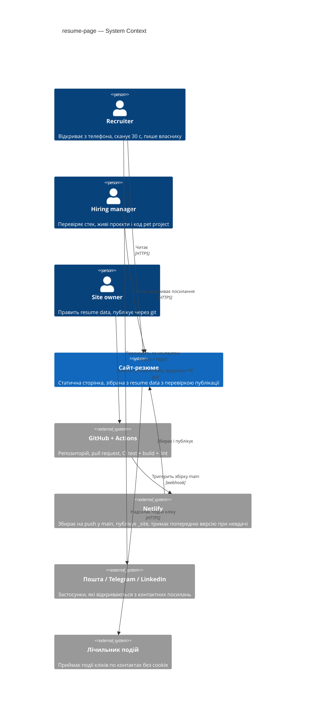
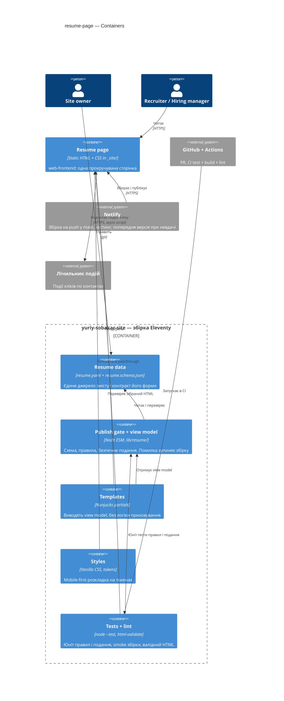
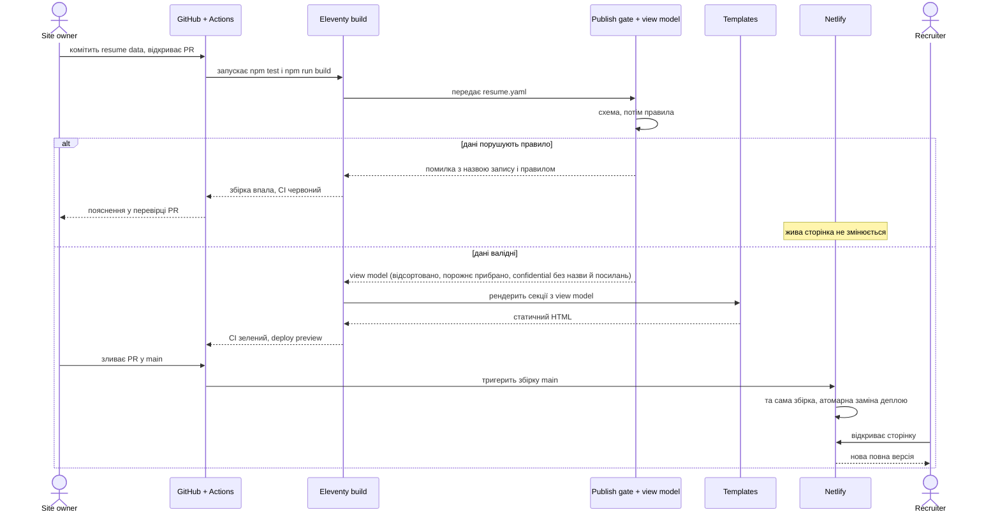
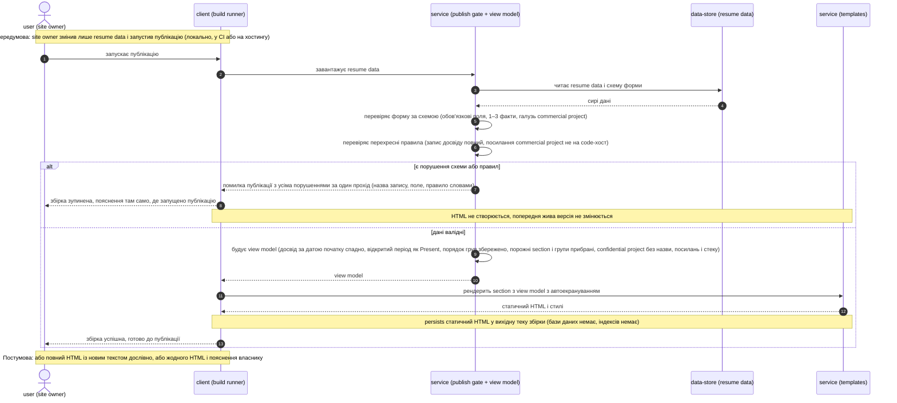
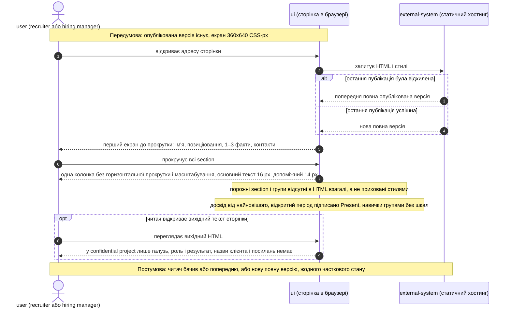
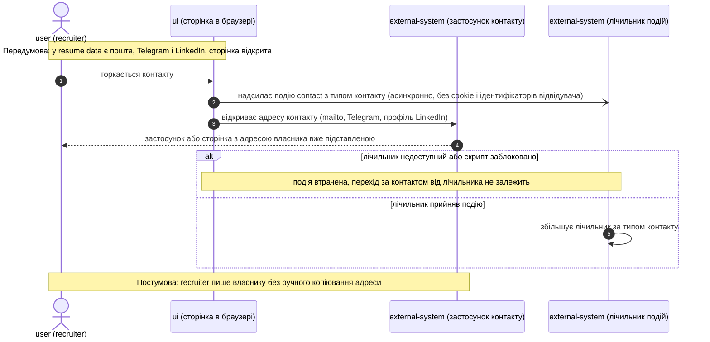

# Software Architecture Document — resume-page

> **Glossary:** [CONTEXT](../../../CONTEXT.md) (канонічні ролі й терміни; §12 нижче лише витяг).
> **Upstream:** [spec.md](./spec.md) · [architecture-map.md](../../architecture-map.md) · фундаментні ADR `docs/adr/0001–0004` · ADR фічі — [adr/](./adr/).

## 1. Introduction and goals

**Intent.** Адаптивна односторінкова сторінка-резюме, яка збирається зі статичного HTML з одного файлу resume data і працює як *безпечне подання даних*: recruiter з телефона за 30 секунд бачить ім'я, позиціювання, 1–3 факти і контакти в один дотик; hiring manager перевіряє commercial project за живими посиланнями і pet project за кодом; site owner оновлює все правкою одного файлу, а небезпечні стани (порожні обов'язкові поля, код commercial project, розкритий confidential project) зупиняють публікацію ще до того, як щось потрапить на живу сторінку (spec §2).

**Top-3 quality goals (1-liners; full scenarios in §10):**

1. Швидкість і легкість на мобільному: PageSpeed Insights mobile Performance ≥ 95, ≤ 150 КБ переданих байтів першого відкриття.
2. Безпека публікації: жодне порушення правил resume data не доходить до живої сторінки; відвідувач бачить або попередню, або нову повну версію.
3. Оновлюваність: правка resume data стає живою сторінкою за ≤ 5 хвилин, без дотику до шаблонів чи стилів.

**Stakeholders.**

| Role | Interest | Sign-off owner? |
|---|---|---|
| recruiter | Відкриває з телефона, сканує 30 с, пише в один дотик | No |
| hiring manager | Читає стек, відкриває живі проєкти і код pet project | No |
| site owner | Править resume data, публікує; хоче, щоб небезпечне не публікувалось | Yes (власник продукту) |
| Tech Lead | Затвердження SAD і ADR | Yes |

**Decision overrides.**

- Decision override: розмір фічі S (за `.size` і роадмапом, крок 4), хоча карта архітектури §Constraints каже «Розмір XS і профіль Pro» — rationale: XS у карті стосується проєкту загалом на момент брифа, до декомпозиції роадмапом на 7 кроків; орієнтир «3–5 задач» і правило «жодних нових контейнерів без ADR» цією фічею збережені (єдина нова зовнішня система — лічильник, зафіксований `adr/0003`). Карту оновить `survey` після `scaffold` (рядок у §11).

## 2. Constraints

**Technical.**
- Node.js 20+ (ESM), без TypeScript і транспіляції — карта архітектури §Stack.
- Eleventy 3 (`@11ty/eleventy`) з шаблонами Nunjucks; вихід — статичний HTML у `_site/` — `docs/adr/0001`.
- Один файл даних `src/_data/resume.yaml` + `src/_data/resume.schema.json`; YAML підключається через data extension — `docs/adr/0002`.
- Чистий CSS з кастомними властивостями у `src/styles/tokens.css`; mobile-first; друковані стилі лише у `print.css` (сама друкована версія — крок 5 роадмапу, поза цією фічею) — `docs/adr/0003`.
- Без клієнтського JavaScript, окрім `window.print()` (крок 5) **і одного скрипта лічильника подій за ADR фічі `adr/0003`** (свідомий виняток, ризик у §11).
- Хостинг Netlify: збірка `npm run build`, публікація `_site`, гілка `main` = production; CI GitHub Actions: `npm test` → `npm run build` → `npm run lint`.
- Тести: вбудований ранер Node (`node --test`), файли `test/*.test.js`; lint: `html-validate` по зібраному HTML.

**Organisational.**
- Розмір S, маршрут quick, профіль Pro (`interview_depth: easy`, один агент, Sonnet у ролях виконавців).
- Одна людина виконує всі ролі; «Tech Lead» — роль у SDD-процесі, не окрема особа.
- Дедлайн м'який: перший шип у межах воркшопу 2026-09-05 і найближчих днів.
- Передумови з роадмапу: крок 1 (скелет, `/sdd:scaffold`) і крок 2 (реальний зміст `resume.yaml`) ще не виконані — ця фіча спирається на заплановану структуру карти, не на наявний код (ризик у §11).

**Conventions.**
- Карта архітектури §Conventions (після scaffold — також `CLAUDE.md`): весь текст із `resume.yaml`, нове поле = схема + YAML, один партіал на section, токени лише через кастомні властивості.
- Гілки `feat/<slug>`, у `main` через pull request із зеленим CI і deploy preview Netlify; коміти `type: summary`.
- Помилка даних зупиняє збірку з повідомленням про поле, а не публікує порожню секцію.

**Regulatory / external.**
- Дані — публічні дані самого власника (spec §6.1: класифікація public); чужих персональних даних немає.
- Телефон за дефолтом не публікується (spec §8, рішення власника відкрите до `sdd:tasks`).
- Лічильник кліків не ставить cookie і не ідентифікує відвідувача (spec §6.1), тож банер згоди не потрібен.
- Код commercial project — комерційна таємниця: посилання на код заборонене правилом, а не позначкою (spec §1, Decision override).

## 3. Context and scope

Сайт-резюме — статична сторінка, яку читають recruiter і hiring manager, а публікує site owner, комітячи resume data в репозиторій на GitHub. Netlify збирає сайт на кожен push у `main` і замінює живу версію лише після успішної збірки; невдала збірка залишає попередню версію. Контактні посилання ведуть у зовнішні застосунки (пошта, Telegram, LinkedIn), а кліки по них рахує сторонній лічильник подій.

<!-- brownfield: N/A — greenfield repo. У репозиторії лише docs/ і CONTEXT.md; docs/architecture-map.md (mode: greenfield-bootstrap) описує скелет, який матеріалізує /sdd:scaffold. -->

**External systems (in / out):**

| Actor or system | Type | Interaction |
|---|---|---|
| recruiter | Person | Відкриває сторінку з телефона, читає, торкається контакту |
| hiring manager | Person | Читає стек, відкриває живі посилання проєктів і код pet project |
| site owner | Person | Править resume data, відкриває PR, зливає в `main` |
| GitHub + Actions | System (external) | Зберігає код; CI запускає `npm test`, `npm run build`, `npm run lint` на PR; показує помилку публікації у перевірці PR |
| Netlify | System (external) | Збирає `npm run build` на push у `main`, публікує `_site`, тримає попередній деплой при невдалій збірці; deploy preview для PR |
| Пошта / Telegram / LinkedIn | System (external) | Застосунки-адресати контактних посилань (`mailto:`, `https://t.me/…`, профіль LinkedIn) |
| Лічильник подій | System (external) | Приймає події кліків по контактах без cookie (`adr/0003`) |
| PageSpeed Insights / Lighthouse | System (external, вимір) | Перевірка NFR при кожному релізі; у діаграму не входить |

**C4 Context (L1):**



Контекст: три людини (recruiter, hiring manager, site owner) навколо однієї системи «Сайт-резюме»; власник публікує через GitHub, GitHub тригерить Netlify, Netlify збирає і віддає сторінку читачам; контакти ведуть у зовнішні застосунки, кліки летять у лічильник.

## 4. Solution strategy

**Target surface(s).** `target_surfaces: [web-frontend]` — єдина поверхня. Фіча вводить один контейнер C4: статичну веб-сторінку в `_site/`. Серверного коду немає (Netlify — статичний хостинг, карта §Constraints), тому `backend-service` відсутній; логіка перевірки й підготовки даних виконується на етапі збірки і є частиною цієї ж поверхні, а не окремим `cli`/`worker`. Одна поверхня, і вона вже задана фундаментом (`docs/adr/0001`: статичний HTML з Eleventy) — blast-radius gate не спрацьовує, окремий ADR не потрібен.

**UI-architecture (web-frontend).** Server-rendered на етапі збірки (статичний пре-рендер, SSG), нуль клієнтського JavaScript окрім винятків, зафіксованих ADR. Успадковано з `docs/adr/0001`; стан і роутинг відсутні (одна сторінка без взаємодії, spec §3: ніщо не приховане за наведенням, розгортанням чи вкладками). UI повторно використовує фундамент із карти §Frontend: партіали секцій, токени `tokens.css`, примітиви `section` / `tag` / `card` / `timeline-item`.

**Top strategic choices (the seeds for ADRs):**

1. **Publish gate у збірці: JSON Schema для форми + модуль правил для перехресних інваріантів** (`adr/0001`). Схема тримає обов'язкові поля, типи, 1–3 факти; `lib/resume/rules.js` перевіряє посилання commercial project на code-хост, результат у записі досвіду, галузь у commercial project і формулює помилку словами з назвою запису. Будь-яке порушення зупиняє `npm run build` і `npm test`, тож Netlify не замінює живу версію, а site owner бачить пояснення у перевірці PR (AC-03b, AC-05, AC-07, AC-09; якість 2).
2. **Шаблони отримують безпечне подання даних, а не сирий YAML** (`adr/0002`). Data extension повертає view model: у confidential project назва і посилання відсутні як поля, досвід відсортований за датою початку від найновішого, порожні section і групи прибрані, дати відформатовані. Партіали лише виводять; секрет фізично не потрапляє в шаблонний контекст (AC-03, AC-04, AC-06, AC-08).
3. **Публікація = злиття в `main` через PR із зеленим CI; атомарність дає Netlify.** Той самий конвеєр `test → build → lint` виконується локально, у CI і на Netlify; невдала збірка не створює деплою, тож жива сторінка або попередня, або нова повна (AC-09, NFR «Атомарність»). Успадковано з конвенцій фундаменту — inline, без ADR.
4. **Вимірюваність через легкий лічильник подій без cookie** (`adr/0003`). Один асинхронний скрипт і один обробник кліків у `layout.njk`; свідомий виняток із правила «без клієнтського JS», обмежений рівно цим скриптом (spec §7 KPI, §6.1).
5. **Одна прокручувана сторінка на токенах, нічого за взаємодією.** Mobile-first розкладка на `tokens.css`; порядок і заголовки section з resume data; жоден зміст не прихований за наведенням, вкладками чи каруселлю, щоб друковане подання (крок 5) отримало все без переверстки (spec §3). Конвенція фундаменту — inline.

Each tactical decision in later sections should trace to one of these seeds. Tactical decisions that *contradict* a strategic choice are red flags — surface them in §11.

## 5. Building block view

Стиль — лінійний конвеєр збірки всередині одного deployable: **resume data → publish gate → view model → шаблони → статичний HTML**. Шар даних (`lib/resume/`) не знає про Nunjucks, шаблони не знають про правила; єдина точка зшивання — data extension в `eleventy.config.js`. Такий поділ обрано, бо обидві ADR-опори (перевірка і безпечне подання) потребують коду, який тестується без збірки сайту, а партіали мають лишатися простими для правки вигляду.

**Internal decomposition:**

```
src/_data/
├── resume.yaml                 resume data — весь зміст (наповнення: крок 2 роадмапу)
├── resume.schema.json          JSON Schema: форма даних (обов'язкові поля, типи, 1–3 факти)
└── site.json                   службові налаштування сайту, не зміст (адреса лічильника)
lib/resume/
├── load.js                     читає YAML → схема → правила → view model; кидає ResumeValidationError
├── rules.js                    перехресні інваріанти: code-хост у commercial, результат у досвіді, галузь
├── code-hosts.js               домени сервісів хостингу коду (AC-05)
└── view-model.js               сортування досвіду, прибирання порожніх section/груп, стрип confidential, дати
eleventy.config.js              data extension yaml → lib/resume/load.js; у шаблонах доступно як `resume`
src/index.njk                   сторінка; порядок section — з view model
src/_includes/
├── layout.njk                  <head>, landmarks, підключення стилів, тег лічильника + обробник кліків
└── sections/
    ├── hero.njk                ім'я, позиціювання, факти, контакти
    ├── experience.njk          записи досвіду (роль, компанія, період, результати)
    ├── skills.njk              групи навичок
    ├── projects.njk            одна картка на проєкт; поля вже підготовлені view model
    └── contacts.njk            контакти з data-атрибутом типу для лічильника
src/styles/
├── tokens.css                  палітра, відступи, типографіка (розміри тексту 16/14 px тут)
├── base.css                    примітиви: section, tag, card, timeline-item, button
└── layout.css                  mobile-first сітка, брейкпоінти 360 / 768 / 1280
test/
├── resume-rules.test.js        юніт: кожен інваріант → помилка з назвою запису і правилом
├── view-model.test.js          юніт: порядок досвіду, порожнє прибрано, confidential без назви і посилань
└── build.test.js               збірка у tmp: секції на місці, назва confidential відсутня в HTML
```

**C4 Container (L2):**



Контейнери: усередині збірки — resume data, publish gate + view model, шаблони, стилі, тести; результат — один контейнер поверхні `web-frontend` (статична сторінка), який Netlify збирає і публікує, GitHub ганяє тести в CI, а сторінка надсилає події кліків у лічильник.

## 6. Runtime view

**Critical flow 1: публікація правки resume data (happy path + відхилення)**



Потік: власник комітить дані і відкриває PR; CI запускає збірку; publish gate ганяє схему, потім правила. Якщо є порушення — збірка падає, власник бачить назву запису і правило у перевірці PR, жива сторінка не змінюється. Якщо все валідно — шаблони рендерять view model, CI зелений, власник зливає в `main`, Netlify повторює ту саму збірку і атомарно замінює деплой, читач бачить нову повну версію.

> Потоки 2–4 нижче додала стадія `sequences` (розмір S: деталь згорнута, покриття AC повне). Учасники — узагальнений словник рантайм-подання (`user` / `ui` / `client` / `service` / `data-store` / `external-system`) з роллю в дужках; конкретні технології названі у §2, §5 і §7.

### Flow 2 — збірка: publish gate і view model



Потік: власник запускає публікацію, build runner просить сервіс завантажити resume data; сервіс читає дані і схему, перевіряє форму (обов'язкові поля, 1–3 факти, галузь commercial project), потім перехресні правила (повний запис досвіду, жодного посилання commercial project на code-хост). Порушення — збірка зупиняється, власник отримує всі порушення разом із назвою запису, полем і правилом там, де запускав публікацію, HTML не створюється. Валідні дані — сервіс будує view model (сортування досвіду, Present, порядок груп, прибирання порожнього, стрип confidential project), шаблони рендерять його з автоекрануванням у статичний HTML. Покриває AC-03, AC-03b, AC-04, AC-05, AC-06 (стрип у даних), AC-07, AC-08 (прибирання), AC-11.

### Flow 3 — читач відкриває сторінку з телефона



Потік: читач відкриває адресу, сторінка запитує HTML і стилі у хостингу; хостинг віддає або попередню повну версію (якщо остання публікація відхилена), або нову повну. До прокрутки видно ім'я, позиціювання, 1–3 факти і контакти; під час прокрутки на 360 px — одна колонка без горизонтальної прокрутки, текст 16/14 px; порожні section і групи в HTML відсутні, досвід від найновішого, навички групами. Якщо читач відкриває вихідний текст — у confidential project лише галузь, роль і результат. Покриває AC-01, AC-03 (подання), AC-04 (подання), AC-06 (view-source), AC-08 (подання), AC-09 (гілка «відхилена публікація»), AC-10.

### Flow 4 — дотик до контакту з подією лічильника



Потік: recruiter торкається контакту; сторінка асинхронно надсилає подію з типом контакту у лічильник і відкриває адресу контакту у відповідному застосунку з уже підставленою адресою власника. Якщо лічильник недоступний або скрипт заблоковано — подія втрачена, перехід працює як і раніше; якщо прийняв — лічильник за типом збільшується. Покриває AC-02 і KPI «кліки по контактах» (spec §7).

### Coverage — §4 user stories та §5 AC → flow

| US | Flow(s) |
|---|---|
| US-01 перший екран веде до контакту | Flow 3, Flow 4 |
| US-02 досвід від нового до старого | Flow 2 (view model), Flow 3 (подання) |
| US-03 навички групами і проєкти з посиланнями | Flow 2 (view model, правило code-хосту), Flow 3 (подання) |
| US-04 оновлення без верстки | Flow 1, Flow 2 |
| US-05 захист від порожнього і зламаного | Flow 1, Flow 2, Flow 3 |
| US-06 confidential project не розкривається | Flow 2 (стрип), Flow 3 (view-source) |
| US-07 читається з телефона | Flow 3 |

| AC | Де показано |
|---|---|
| AC-01 | Flow 3, крок «перший екран до прокрутки» |
| AC-02 | Flow 4, happy path |
| AC-03 | Flow 2 else-гілка (сортування, Present), Flow 3 нотатка |
| AC-03b | Flow 2 alt-гілка «порушення схеми або правил» (правило «запис досвіду повний») |
| AC-04 | Flow 2 else-гілка (порядок груп), Flow 3 нотатка |
| AC-05 | Flow 2 alt-гілка (посилання commercial project на code-хост) |
| AC-06 | Flow 2 else-гілка (стрип), Flow 3 opt «вихідний текст» |
| AC-07 | Flow 2 alt-гілка (схема: обов'язкові поля, 1–3 факти, галузь) |
| AC-08 | Flow 2 else-гілка (прибирання), Flow 3 нотатка |
| AC-09 | Flow 1 alt-гілка «дані порушують правило», Flow 3 alt «остання публікація відхилена» |
| AC-10 | Flow 3, крок «прокручує всі section» |
| AC-11 | Flow 1 else-гілка, Flow 2 постумова («новий текст дослівно») |

**Flags for `design` / ADR (лише позначено, нічого не додано автоматично):**

- Flow 1 (написаний на стадії `design`) називає конкретні системи (GitHub, Netlify, Eleventy); за правилом «додавати, не переписувати» він залишений як є. Кандидат на ручне узгодження зі словником потоків 2–4.
- Flow 4: подія лічильника — fire-and-forget із браузера у сторонній сервіс, без ідемпотентності, повторів і dead-letter. Свідомо: подія не є бізнес-транзакцією, втрата допустима (`adr/0003`); окремого ADR не потрібно.
- Жоден потік не пише в базу даних (persist лише статичний HTML у теку збірки) — для `data-model` умова «немає зміни схеми» виконується.
- `ux-flows.md` для фічі відсутній; шлях екранів у Flow 3–4 виведено зі spec §4/§5 (одна сторінка без переходів).

## 7. Deployment view

Фіча не змінює одиницю деплою фундаменту: Netlify збирає `npm run build` на push у `main` і публікує `_site/` як статичні файли з CDN; реплік і масштабування немає. Ключова властивість для AC-09 — деплой атомарний: Netlify створює новий деплой лише з успішної збірки і перемикає на нього одразу, невдала збірка залишає попередній деплой активним. Pull request отримує deploy preview на окремій адресі, тож перевірку на трьох ширинах можна зробити до злиття.

**Monitoring:**
- Статус збірки Netlify (сповіщення про невдалий деплой на пошту власника) і статус CI на PR — єдині сигнали про відхилену публікацію.
- PageSpeed Insights mobile і Lighthouse Accessibility — вручну при кожному релізі (spec §6); значення записуються у changelog релізу.
- Дашборд лічильника подій — кліки по контактах за типом (spec §7 KPI).

**Scaling thresholds:**
- N/A — статичний CDN-хостинг; єдиний поріг — вага сторінки ≤ 150 КБ, перевіряється мережевою панеллю без кешу при кожному релізі.

## 8. Crosscutting concepts

| Concept | Convention | Where defined |
|---|---|---|
| Помилки даних | `ResumeValidationError` збирає **всі** порушення за один прохід; кожне — рядок `resume.yaml › <шлях до поля>: <правило словами>` (напр. `projects[2] "Acme": код commercial project не публікується`); збірка завершується ненульовим кодом | `lib/resume/load.js`, `rules.js`; цей SAD §4 опора 1 |
| Логування | Лише stderr збірки; рантайм-логів немає (статика) | — |
| Автентифікація / авторизація | N/A — сторінка лише для читання; право публікувати = право писати в репозиторій і зливати в `main` | карта §Conventions (PR у `main`) |
| Екранування (XSS) | Nunjucks `autoescape: true`; фільтр `safe` заборонений для будь-якого поля з resume data; текст із даних ніколи не стає розміткою | `eleventy.config.js`; тест `build.test.js` шукає `| safe` у `sections/*.njk` і падає, якщо знайде |
| Confidential project | View model видаляє назву клієнта і **всі** посилання; лишає галузь, роль, результат (за глосарієм); стек також прибирається | `lib/resume/view-model.js`; CONTEXT.md |
| Заборона коду commercial project | Будь-яке посилання commercial project, чий хост збігається з доменом code-хостингу або його піддоменом — порушення. Список: `github.com`, `gitlab.com`, `bitbucket.org`, `codeberg.org`, `git.sr.ht`, `gitee.com`, `dev.azure.com`. Сторінки хостингу `*.github.io`, `*.gitlab.io`, `*.pages.dev` — не код, дозволені як живе посилання | `lib/resume/code-hosts.js` |
| Порожні section і групи | Section без записів або група без записів прибирається з view model; section, у якій усі групи порожні, теж | `lib/resume/view-model.js` |
| Дати | У YAML `start`/`end` у форматі `YYYY-MM`; `end` відсутній = поточна робота, підпис у шаблоні (мова сайту англійська: «Present»); сортування досвіду за `start` спадно | `view-model.js`; `experience.njk` |
| Посилання | Зовнішні посилання проєктів — `target="_blank" rel="noopener noreferrer"`; контакти — `mailto:`, `https://t.me/<user>`, повний URL LinkedIn, без нової вкладки; телефон — не публікується за дефолтом | `projects.njk`, `contacts.njk` |
| Лічильник кліків | Один асинхронний тег скрипта + один обробник у `layout.njk`; подія `contact:<type>` з `data-contact` на посиланні; адреса лічильника у `src/_data/site.json`, не в resume data | `layout.njk`, `contacts.njk`; `adr/0003` |
| Продуктивність | Бюджет ≤ 150 КБ; системний стек шрифтів за дефолтом (поки візуальна концепція з роадмапу не скаже інакше); зображень у v1 немає; CSS — три файли без inline | `tokens.css`; spec §6 |
| Доступність | Landmarks `header / main / footer`, `h1` = ім'я, `h2` = заголовки section; контраст токенів ≥ 4.5:1; розміри тексту в токенах: основний 16 px, допоміжний 14 px; іконки контактів мають текстовий підпис або `aria-label` | `tokens.css`, `base.css`, партіали |
| Інтернаціоналізація | N/A — сайт англійською, одна локаль; службові підписи інтерфейсу — частина шаблону (spec §3) | — |
| ID / міграції | N/A — бази даних немає; порядок і належність задаються позицією в YAML | карта §Conventions |

## 9. Architecture decisions

| # | Title | Status | Section |
|---|---|---|---|
| 0001 | Перевіряти публікацію під час збірки: JSON Schema для форми плюс модуль правил для перехресних інваріантів | Accepted | §4 |
| 0002 | Віддавати шаблонам безпечне подання даних (view model), а не сирий resume data | Accepted | §4 |
| 0003 | Рахувати кліки по контактах легким стороннім лічильником подій без cookie, як виняток із правила «без клієнтського JavaScript» | Accepted | §4 |

ADR files live under `docs/features/resume-page/adr/NNNN-<title>.md`.

Успадковані рішення фундаменту (не дублюються тут): `docs/adr/0001` Eleventy + статичний HTML · `docs/adr/0002` один YAML + JSON Schema · `docs/adr/0003` чистий CSS + окремий `print.css` · `docs/adr/0004` PDF через друк браузера.

## 10. Quality requirements

Три цілі якості з §1 (QG-1…QG-3), розкриті у сценарії, плюс QG-4 — сценарій для рядків NFR спеки §6 (доступність, адаптивність), які не увійшли в top-3, але мають числові цілі й потрібні `plan-tests`:

**QG-1. Швидкість і вага на мобільному**
- **When:** recruiter відкриває сторінку на телефоні шириною 360 px без кешу.
- **Then:** PageSpeed Insights mobile Performance ≥ 95; ≤ 150 КБ стиснутих переданих байтів за всі ресурси першого відкриття (HTML, стилі, скрипти, шрифти, зображення, лічильник).
- **How verify:** PageSpeed Insights при кожному релізі; колонка «Transferred» мережевої панелі браузера з вимкненим кешем при кожному релізі (spec §6).

**QG-2. Безпека публікації**
- **When:** site owner публікує resume data, що порушує будь-яке правило (порожнє обов'язкове поле, фактів 0 або > 3, запис досвіду без ролі / компанії / дати початку / результату, commercial project без галузі або з посиланням на code-хост).
- **Then:** збірка зупиняється і повідомляє назву запису, поле і правило там, де запущено публікацію (консоль або перевірка PR); відвідувач у будь-який момент бачить або попередню, або нову повну версію — 0 порожніх чи часткових станів.
- **How verify:** юніт-тести `resume-rules.test.js` на кожен інваріант; навмисна невдала публікація перед запуском (spec §6): PR із порушенням → CI червоний, Netlify не створює деплой, жива сторінка не змінилась.

**QG-3. Оновлюваність**
- **When:** site owner змінює будь-який зміст (наприклад, результат у записі досвіду) лише у resume data і публікує.
- **Then:** новий текст з'являється на живій сторінці дослівно за ≤ 5 хвилин від збереження resume data; жоден інший файл проєкту не змінювався.
- **How verify:** замір часу на перших трьох правках (spec §6); `git diff --stat` коміту правки показує лише `src/_data/resume.yaml`.

**QG-4. Доступність і адаптивність**
- **When:** сторінка відкрита на ширинах 360, 768 і 1280 px.
- **Then:** Lighthouse Accessibility ≥ 95; контраст тексту ≥ 4.5:1; основний текст ≥ 16 CSS-px, допоміжний ≥ 14 CSS-px; без горизонтальної прокрутки на жодній ширині.
- **How verify:** Lighthouse при кожному релізі; ручна перевірка трьох ширин на deploy preview перед злиттям; перевірка стилів перед публікацією (spec §6).

## 11. Risks and technical debt

| Risk / debt | Severity | Mitigation | Owner |
|---|---|---|---|
| Скелет (крок 1) і зміст (крок 2) роадмапу ще не існують; §5 спирається на заплановану структуру карти | Medium | `/sdd:tasks resume-page` виконувати після `/sdd:scaffold`; якщо scaffold змінить шляхи — оновити карту через `survey` і §5 | site owner |
| Сторонній лічильник: залежність від сервісу і другий скрипт на сторінці всупереч конвенції «без JS» | Low | `adr/0003`; тег асинхронний; PageSpeed Insights при кожному релізі; вимкнути = видалити один тег | Tech Lead |
| Список code-хостів неповний (самохостований Gitea, корпоративний GitLab на власному домені) | Low | Список в одному файлі з тестом на кожен домен; доповнюється без зміни схеми; commercial project із самохостованим кодом і так не має причини мати таке посилання | Tech Lead |
| Вимкнений autoescape або `safe` на полі з даних → розмітка з YAML виконається | Low | `autoescape: true` у конфігу; тест збірки падає на `| safe` у партіалах секцій | Tech Lead |
| Хибне спрацювання правила code-хосту на легітимному живому посиланні commercial project (сайт клієнта на GitHub Pages) | Low | `*.github.io` / `*.gitlab.io` / `*.pages.dev` у списку винятків; повідомлення про помилку називає домен, власник бачить причину одразу | Tech Lead |
| Open architectural decision: публікувати телефон чи лишити пошту, Telegram, LinkedIn | Open question | Resolve before `sdd:tasks`; дефолт зараз — без телефону; схема дозволяє контакт типу phone, рендер не залежить від рішення | site owner |
| Open architectural decision: фото на першому екрані | Open question | Resolve before `sdd:tasks`; дефолт зараз — без фото; у схемі v1 поля немає, додати пізніше = поле в схемі + рядок у `hero.njk` | site owner |
| Мертві живі посилання проєктів помітить recruiter, а не збірка | Low | **Вирішено на design** (закриває spec §8, owner Tech Lead): перевірка посилань — лише попередження, не блокування; поза publish gate, бо потребує мережі в CI і робить збірку нестабільною; необов'язкова задача або follow-up | Tech Lead |
| Карта архітектури каже «Розмір XS», фіча має S; карта описує ще не матеріалізований скелет | Low | Override у §1 ¶4; після `/sdd:scaffold` оновити карту через `/sdd:survey` (нове `reflects_commit`, розміри кроків із роадмапу) | site owner |

**Accepted debt (acceptable in v1, plan to fix later):**
- Схема даних без версіонування: одна версія, один файл; при несумісній зміні полів правиться і схема, і YAML в одному PR.
- Пояснення помилки публікації лише в консолі збірки та перевірці PR, без окремого інтерфейсу — власник сам розробник, цього достатньо.
- Перевірка мертвих посилань відкладена (рядок вище).

## 12. Glossary

| Term | Meaning |
|---|---|
| resume data | Єдиний файл-джерело всього тексту сайту (`src/_data/resume.yaml`): ім'я, позиціювання, факти, досвід, навички, проєкти, контакти. NOT сторінка (CONTEXT.md) |
| section | Блок сторінки: hero, experience, skills, projects, contacts; порядок і заголовки з resume data (CONTEXT.md) |
| commercial project | Проєкт на роботі чи для клієнта: назва, галузь, живе посилання, стек, роль, результат; ніколи не посилання на код (CONTEXT.md) |
| confidential project | Commercial project з позначкою власника: без назви клієнта і посилань, видно лише галузь, роль, результат (CONTEXT.md) |
| pet project | Власний або фріланс-проєкт: назва, живий сайт і посилання на код (CONTEXT.md) |
| факт | Коротке перевірюване твердження до 60 знаків; на hero їх 1–3 (CONTEXT.md) |
| позиціювання | Одне речення до 120 знаків під ім'ям: хто власник і для кого (CONTEXT.md) |
| recruiter · hiring manager · site owner | Ролі читачів і власника за CONTEXT.md |
| publish gate | Перевірка resume data під час збірки (схема + правила), яка зупиняє публікацію з поясненням; `adr/0001`. *Немає в CONTEXT.md — кандидат для `/sdd:glossary`* |
| view model (безпечне подання даних) | Підготовлена для шаблонів модель: без секретів confidential project, відсортована, без порожнього; `adr/0002`. *Кандидат для `/sdd:glossary`* |
| публікація | Злиття PR у `main` із зеленим CI, після якого Netlify збирає і атомарно замінює живу сторінку. *Кандидат для `/sdd:glossary`* |
| code-хост | Сервіс хостингу коду (GitHub, GitLab, Bitbucket тощо); посилання commercial project на нього — порушення publish gate. *Кандидат для `/sdd:glossary`* |
