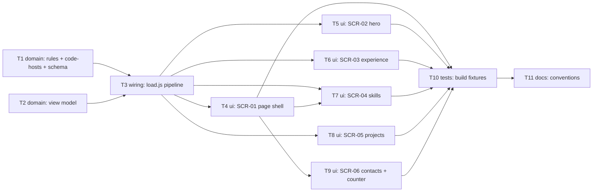

# Epic — resume-page

> **Spec:** [spec.md](../spec.md) · **Design:** [sad.md](../sad.md) · **Screens:** [screens.md](../screens.md) · **ADRs:** [adr/](../adr/) · **Data model / API:** N/A (бази даних і зовнішнього контракту немає — `sad.md` §6 flags, `screens.md` §Source)

## Goal

Перетворити скелет зі `scaffold` на робочу сторінку-резюме за spec §2: recruiter з телефона за 30 секунд бачить ім'я, позиціювання, факти і контакти в один дотик; hiring manager перевіряє проєкти за живими посиланнями; site owner оновлює все правкою `resume.yaml`, а publish gate зупиняє збірку на будь-якому порушенні до того, як щось потрапить на живу сторінку.

## Scope

- **In:** шар даних `lib/resume/` (правила, code-хости, view model, зшивка в `load.js`); схема (`facts` обов'язкові); партіали п'яти section і каркас `layout.njk` / `index.njk`; стилі `base.css` / `layout.css` (новий примітив `fact-list`, сітки 2 колонки); лічильник кліків (`adr/0003`); тести правил, подання і збірки на фікстурах; оновлення `CLAUDE.md` і карти архітектури.
- **Out (spec §3):** друковане подання і кнопка PDF (крок 5), блок «як зроблено» (крок 6), візуальна концепція (fog), наповнення `resume.yaml` реальним змістом (крок 2), перевірка мертвих посилань (`sad.md` §11 — follow-up), реєстрація `fact-list` у `docs/design-system.md` (канону ще немає — `screens.md` §New components).

## Task map

Паралельні гілки: T1 ‖ T2 на старті; після T3 — T4 ‖ T5 ‖ T6 ‖ T8 (T5 і T8 ділять `base.css`, T4 і T9 ділять `layout.njk` — `implement` серіалізує ці пари в одну смугу через перетин `files_hint`).

## Tasks

See [tracker.md](./tracker.md) for status. Machine contract: [tasks.json](../tasks.json).

| # | Task | Layer | Blocked by | DoD (short) |
|---|---|---|---|---|
| T1 | [Publish gate: rules.js + code-хости + схема фактів](./publish-gate-rules.md) | domain | — | кожен інваріант → рядок з назвою запису і правилом; 0 і 4 факти відхилені |
| T2 | [View model: сортування, стрип confidential, прибирання порожнього](./view-model.md) | domain | — | юніт-тести подання зелені; у confidential немає name / links / stack |
| T3 | [Зшити конвеєр у load.js](./wire-load-pipeline.md) | wiring | T1, T2 | `loadResume` повертає view model; зламаний YAML = ненульовий код, без index.html |
| T4 | [SCR-01 каркас: landmarks, порядок section, адаптив](./ui-page-shell.md) | ui | T3 | header / main / footer, h2 у порядку view model, 3 ширини без прокрутки |
| T5 | [SCR-02 hero з fact-list](./ui-hero.md) | ui | T3 | все до fold на 360×640; fact-list на токенах |
| T6 | [SCR-03 experience з Present](./ui-experience.md) | ui | T3 | записи від найновішого, період 14 px, Present без end |
| T7 | [SCR-04 skills: групи чипами, сітка 2 колонки](./ui-skills.md) | ui | T3, T4 | порядок груп збережено, порожня група відсутня |
| T8 | [SCR-05 projects: commercial / pet / confidential](./ui-projects.md) | ui | T3 | три варіанти картки; назва confidential відсутня у HTML |
| T9 | [SCR-06 contacts + лічильник кліків](./ui-contacts-counter.md) | ui | T4 | один async-тег + один обробник; без адреси тег не рендериться |
| T10 | [Тест збірки на фікстурах](./build-test-fixtures.md) | tests | T4–T9 | confidential / порожня section / порядок / landmarks / дослівний текст перевірені |
| T11 | [Оновити CLAUDE.md і карту архітектури](./docs-conventions-update.md) | docs | T10 | нові файли і правила в конвенціях, без дубляжу spec / sad |

## Risks / Hard rules

- **Секрет не потрапляє в шаблонний контекст** (`adr/0002`): у шаблонах жодних умов «сховати, якщо confidential» — це робить view model (T2). Шаблон, що читає сирі поля повз view model, — порушення.
- **`| safe` заборонений на даних** (`sad.md` §8, `CLAUDE.md` правило 7): тест `build.test.js` уже падає на ньому; `autoescape: true` не чіпати.
- **Клієнтський JS — рівно один тег + один обробник лічильника** (`adr/0003`); будь-який інший скрипт потребує ADR.
- **Токени лише через кастомні властивості** (`CLAUDE.md` правило 4); основний текст `--text-base` (16 px), допоміжний `--text-small` (14 px) — AC-10 / QG-4.
- **Жодного хардкоду змісту** в шаблонах, окрім службових підписів (`Live`, `Code`, `Present`, `Confidential`) — spec §3, `CLAUDE.md` правило 1.
- **NFR, які не автоматизуються** (spec §6: PageSpeed ≥ 95, ≤ 150 КБ, Lighthouse a11y ≥ 95, три ширини, навмисна невдала публікація) перевіряються вручну на deploy preview перед злиттям — це робота `ship`, не окрема задача тут.
- **Відкриті питання spec §8** закриті дефолтами: телефон не публікується, фото немає (`sad.md` §11); схема допускає тип `phone`, рендер від рішення не залежить.
