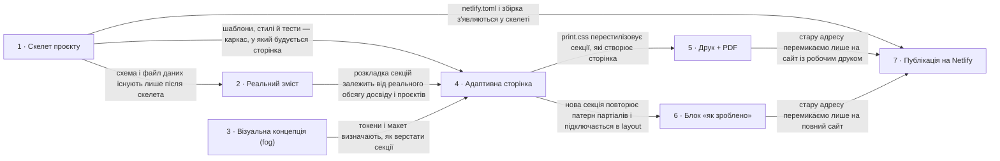

# Roadmap — yuriy-sobakar-site

> **A decomposition, not a promise.** The overall idea broken into incremental steps: what each
> step is, where it comes from, how big it is — or that nobody has looked at it yet — and in which
> order, and parallel lanes, we walk them. **No dates** (except shipped history), **no scores** —
> order is the prioritization. The *solution* for any step lives in its `docs/features/<slug>/`
> spec, not here.

## Destination

Рекрутер відкриває одну адаптивну сторінку з актуальним досвідом Юрія і за один клік отримує строге PDF-резюме, а Юрій оновлює все правкою одного YAML-файлу.

## Steps

| # | Step | Source | Size | Status |
|---|---|---|:---:|---|
| 1 | Скелет проєкту: Eleventy, `resume.yaml` + схема, чотири CSS-файли, тести на `node --test`, CI, конфіг Netlify — сайт збирається і тести зелені на порожньому змісті | `architecture-map.md` §Stack, `_scaffold/tasks.json` | S | shipped |
| 2 | Реальний зміст у `resume.yaml`: оновлений досвід і навички за останній рік, проєкти з посиланнями, нерелевантне прибрано | `idea-brief.md` §2 Problem, §8 Open questions | S | idea |
| 3 | Візуальна концепція «цікавішого» дизайну: палітра, типографіка, макет секцій → see [Not yet specified](#not-yet-specified) | `idea-brief.md` §1 Raw idea, §6 Risks | fog | idea |
| 4 | Адаптивна сторінка резюме з даних: hero з позиціюванням, досвід, навички, проєкти, контакти — читається з телефона за 30 секунд → [`features/resume-page/`](features/resume-page/spec.md) | `idea-brief.md` §7 Recommendation, §3 Users | S | shipped |
| 5 | Друковане подання + кнопка «Download PDF»: та сама сторінка друкується як строге резюме на 1–2 аркуші A4 | `idea-brief.md` §7 Recommendation, `adr/0004-pdf-via-browser-print.md` | XS | idea |
| 6 | Блок «як зроблено цей сайт» з посиланнями на відкритий репозиторій, бриф, карту архітектури і роадмап | `idea-brief.md` §7 Recommendation | XS | idea |
| 7 | Публікація: підключити репозиторій до наявного безкоштовного Netlify-сайту, зберегти адресу yuriy-sobakar.netlify.app, старий сайт замінено новим | `idea-brief.md` §8 Open questions, `architecture-map.md` §Stack | XS | idea |

## Not yet specified

| Area | What we'd have to learn | Blocks | How it gets sharpened |
|---|---|:---:|---|
| Візуальна концепція | Що саме означає «цікавіший дизайн» для власника: настрій (стримано-технічний чи яскравий), палітра, шрифти, чи потрібна темна тема, як виглядає hero і картки проєктів — і все це в межах правила «нічого, що не переживає друк» | 3 | Розмова з власником над 2–3 референсами схожих сайтів (або `/sdd:design-system`, tool: code-only); результат — токени в `tokens.css` і опис макета, після чого крок 3 отримує реальний розмір |

## Out of scope

- Блог і статті — вимагають регулярного письма; порожній блог шкодить (`idea-brief.md` §5).
- Контактна форма з відправкою листів — потребує серверної частини і породжує спам; достатньо прямих посилань (`idea-brief.md` §5).
- Друга мова (українська версія сайту) — рекрутери IT-ринку читають англійською; подвоює підтримку (`idea-brief.md` §5).
- Окремі сторінки-кейси по кожному проєкту — довго; у першій версії достатньо карток з посиланнями (`idea-brief.md` §5).
- Адмінка або CMS — зайва інфраструктура для односторінковика однієї людини (`idea-brief.md` §5).
- Власний домен — сайт залишається на безкоштовному Netlify-піддомені за рішенням власника.

## Open decisions

| # | Question | Type | Owner | Blocks |
|---|---|:---:|:---:|:---:|
| D1 | Який перелік проєктів і навичок за останній рік дають папки `/web` (комерційні дочірні теми) і `/root/projects` (пет-проєкти) — назви, стек, публічні посилання | research | agent | 2 |
| D2 | Які з комерційних робіт (зокрема дочірні теми клієнтів) можна показувати публічно, а які лишити без назви клієнта | grilling | human | 2 |
| D3 | PDF на одну сторінку чи на дві; чи потрібне фото у друкованій версії | grilling | human | 5 |

## Decisions so far

- Позиціювання: WordPress/PHP-розробник з комерційним досвідом, який росте у full-stack; навчальні задачки і Codewars прибрано → [`idea-brief.md` §7](idea-brief.md)
- Один зміст, два подання (екранне і друковане); дизайн не спирається на те, що не друкується → [`idea-brief.md` §6](idea-brief.md)
- Генератор сайту — Eleventy, статичний HTML без клієнтського JS → [`adr/0001`](adr/0001-static-site-generator-eleventy.md)
- Весь зміст в одному YAML з JSON Schema → [`adr/0002`](adr/0002-content-single-yaml-with-schema.md)
- Стилі — чистий CSS з кастомними властивостями і окремим `print.css` → [`adr/0003`](adr/0003-styling-vanilla-css-and-print-view.md)
- PDF через друковані стилі і системний друк браузера → [`adr/0004`](adr/0004-pdf-via-browser-print.md)
- Тести `node --test`, CI GitHub Actions, деплой Netlify → [`architecture-map.md` §Stack](architecture-map.md)
- Адреса лишається yuriy-sobakar.netlify.app, безкоштовний план Netlify → рішення власника під час roadmap-сесії (цей файл, §Out of scope)

## Dependency graph

## Execution path

| Wave | Steps | Zone per step (why parallel-safe) | Unlocks |
|:---:|---|---|---|
| 1 | 1 | весь репозиторій `(new)`: `package.json`, `eleventy.config.js`, `src/`, `test/`, `.github/`, `netlify.toml` — єдина дорожка, конфліктів нема; паралельно йде розвідка фогу «Візуальна концепція» (розмова, не код) | 2, 4 (разом із 2 і 3), 7 |
| 2 | 2 | `src/_data/resume.yaml` `(new)` + `src/_data/resume.schema.json` `(new)` — лише дані | 4 |
| 3 | 4 | `src/_includes/sections/` `(new)`, `src/_includes/layout.njk` `(new)`, `src/styles/tokens.css` / `layout.css` / `base.css` `(new)` | 5, 6 |
| 4 | 5 ∥ 6 | 5: `src/styles/print.css` `(new)` · 6: `src/_includes/sections/built-with.njk` `(new)` + поле в `resume.yaml` (різні файли; спільний дотик — один рядок `include` у `layout.njk`, зливається тривіально) | 7 |
| 5 | 7 | `netlify.toml` `(new)` + налаштування в панелі Netlify (поза репозиторієм) | — |

## Shipped

| Step | Shipped | Link |
|---|---|---|
| 1 | 2026-09-05 | `main` `29f50af` (scaffold: materialize skeleton) |
| 4 | 2026-09-05 | PR `feat/resume-page` → `main`, [changelog](features/resume-page/changelog.md), [review PASS](features/resume-page/_review/review-2026-09-05.md) |
